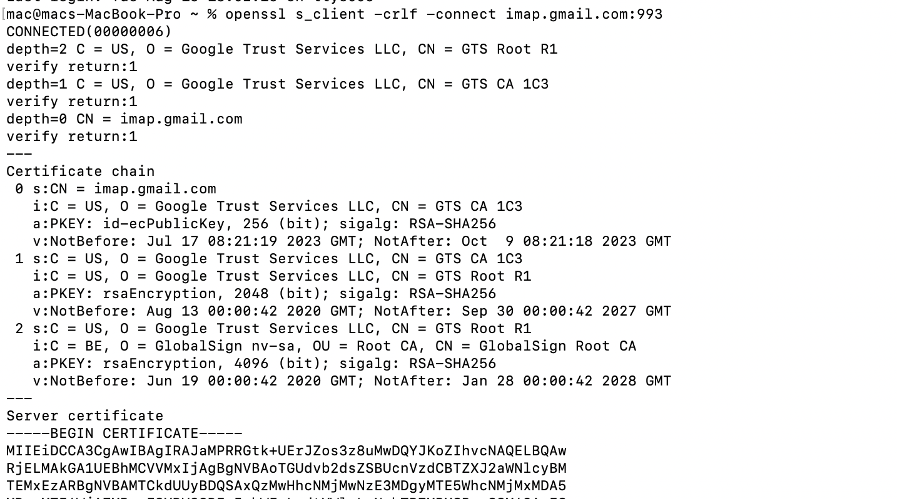
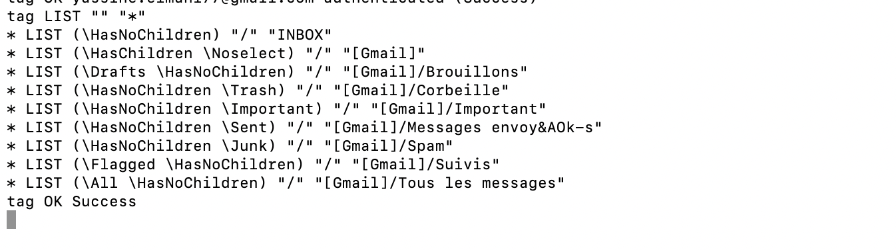

# IMAP 
IMAP stands for "Internet Message Access Protocol." It is a standard protocol used for accessing and managing email messages on a mail server. IMAP is designed to enable users to view and manipulate their email messages without necessarily downloading them to their local devices.
To establish a connection with the Gmail IMAP server, we initiate the following command:

Instead of using your actual password you're supposed to generate a token and login with it https://myaccount.google.com/apppasswords

This command lists all mailboxes:
