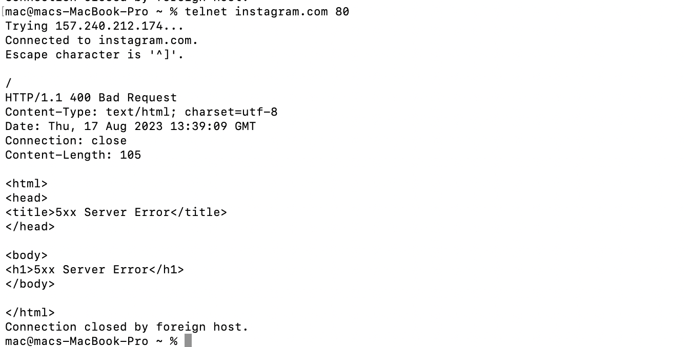

# IMAP 
IMAP stands for "Internet Message Access Protocol." It is a standard protocol used for accessing and managing email messages on a mail server. IMAP is designed to enable users to view and manipulate their email messages without necessarily downloading them to their local devices.
To establish a connection with the Gmail IMAP server, we initiate the following command:

Instead of using your actual password you're supposed to generate a token and login with it https://myaccount.google.com/apppasswords

This command lists all mailboxes:

# Telnet 
Telnet is a network protocol and application that enables a user to remotely access and interact with a computer or networking device over a network, typically the Internet. It operates in a client-server model, where the client-side software (known as a "Telnet client") connects to the server-side software (the "Telnet server") to establish a text-based communication session.
